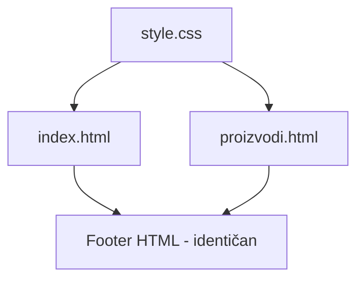

# Design Document: Footer Upgrade

## Overview

Nadogradnja footera na web stranici Stolarija Tukara. Trenutni footer na index.html je minimalan (samo copyright i adresa), a proizvodi.html uopće nema footer. Ovaj dizajn definira profesionalan, vizualno bogat footer koji će se koristiti na obje stranice s identičnim sadržajem.

Footer će biti implementiran kao statički HTML/CSS komponent s tri glavne sekcije (kontakt, navigacija, društvene mreže) plus copyright traka na dnu. Stilovi će biti definirani u zajedničkom `style.css` kako bi se osigurala konzistentnost na obje stranice.

## Architecture

### Pristup

Footer je čisto prezentacijski komponent — nema backend logike, API poziva ni dinamičkog sadržaja. Implementacija se svodi na:

1. **HTML struktura** — semantički `<footer>` element s ARIA atributima
2. **CSS stilovi** — dodani u `style.css` (koji se već koristi na obje stranice)
3. **Identičan HTML** — kopiran u `index.html` i `proizvodi.html`

### Razlog za dupliciranje HTML-a umjesto JS injectiona

Budući da je ovo statička stranica bez build alata, frameworka ili template enginea, najjednostavniji i najrobustniji pristup je duplicirati footer HTML u obje datoteke. Prednosti:
- Nema ovisnosti o JavaScriptu za prikaz footera
- SEO-friendly (sadržaj je u DOM-u odmah)
- Nema FOUC (Flash of Unstyled Content) problema



## Components and Interfaces

### Footer struktura (HTML)

```
<footer class="site-footer">
  ├── .footer-main (grid container, 3 kolone)
  │   ├── .footer-contact (kontakt informacije)
  │   │   ├── h3 "Kontakt"
  │   │   ├── p (naziv obrta)
  │   │   ├── p (adresa)
  │   │   ├── a[href="tel:..."] (telefon)
  │   │   ├── a[href="mailto:..."] (email)
  │   │   ├── p (OIB)
  │   │   ├── p (vlasnik)
  │   │   └── .footer-hours (radno vrijeme)
  │   │       ├── p "Radno vrijeme:"
  │   │       ├── p "Pon – Pet: 08:00–16:00"
  │   │       └── p "Sub: 08:00–12:00"
  │   │
  │   ├── .footer-nav (brza navigacija)
  │   │   ├── h3 "Brza navigacija"
  │   │   └── ul
  │   │       ├── li > a "Početna"
  │   │       ├── li > a "Usluge"
  │   │       ├── li > a "Proizvodi"
  │   │       ├── li > a "O nama"
  │   │       └── li > a "Kontakt"
  │   │
  │   └── .footer-social (društvene mreže i partner)
  │       ├── h3 "Pratite nas"
  │       ├── a (Instagram link s ikonom)
  │       └── .footer-partner
  │           ├── p "Službeni partner"
  │           └── a > img (GEALAN logo)
  │
  └── .footer-bottom (copyright traka)
      └── p "© 2025 Stolarija Tukara. Sva prava pridržana."
</footer>
```

### Navigacijski linkovi — ponašanje po stranici

| Stranica | Link format | Ponašanje |
|----------|-------------|-----------|
| index.html | `#home`, `#services`, itd. | Smooth scroll do sekcije |
| proizvodi.html | `index.html#home`, `index.html#services`, itd. | Redirect na index + anchor |

### CSS klase

| Klasa | Opis |
|-------|------|
| `.site-footer` | Glavni footer container (već postoji, bit će proširen) |
| `.footer-main` | Grid layout za 3 kolone |
| `.footer-contact` | Sekcija s kontakt podacima |
| `.footer-nav` | Sekcija s navigacijskim linkovima |
| `.footer-social` | Sekcija s društvenim mrežama i partnerom |
| `.footer-bottom` | Copyright traka na dnu |
| `.footer-hours` | Blok s radnim vremenom |
| `.footer-partner` | GEALAN partner blok |

## Data Models

Nema podatkovnih modela — ovo je čisto statički HTML/CSS komponent bez dinamičkih podataka ili stanja.

### Statički podaci u footeru

| Podatak | Vrijednost |
|---------|-----------|
| Naziv | Stolarija Tukara |
| Adresa | Kralja Tomislava 21A, 32276 Babina Greda |
| Email | drago.tukara95@gmail.com |
| Telefon | +385 99 680 6531 |
| OIB | 39756036925 |
| Vlasnik | Drago Tukara |
| Radno vrijeme (radni dani) | Pon – Pet: 08:00–16:00 |
| Radno vrijeme (subota) | Sub: 08:00–12:00 |
| Instagram | https://www.instagram.com/dragotukara/ |
| GEALAN | https://www.gealan.de/en/home/ |

## Error Handling

Budući da je ovo statički HTML/CSS komponent, nema runtime grešaka za obradu. Jedine potencijalne "greške" su:

1. **Broken linkovi** — osigurano korištenjem ispravnih URL-ova i anchor ID-ova koji već postoje u index.html
2. **Font loading failure** — fontovi su već definirani u `<head>` obje stranice; footer koristi iste fontove
3. **Slika GEALAN loga** — koristi se postojeća slika `img/gealan-logo2.png` koja je već na stranici

## Testing Strategy

### Zašto PBT nije primjenjiv

Ova značajka je čisto UI rendering — statički HTML i CSS bez:
- Čistih funkcija s ulazom/izlazom
- Transformacija podataka
- Parsiranja ili serijalizacije
- Poslovne logike

Nema univerzalnih svojstava koja bi se mogla testirati property-based pristupom.

### Preporučeni testovi

**Manualni vizualni testovi:**
- Provjera izgleda na desktop (1920px, 1440px, 1024px)
- Provjera izgleda na tablet (768px)
- Provjera izgleda na mobitel (480px, 375px)
- Provjera hover efekata na linkovima
- Provjera da su svi linkovi klikabilni i vode na ispravne destinacije

**Funkcionalni testovi (ručni):**
- Klik na `tel:` link otvara dialer na mobitelu
- Klik na `mailto:` link otvara email klijent
- Klik na Instagram link otvara novu karticu
- Klik na GEALAN link otvara novu karticu
- Navigacijski linkovi na index.html skrolaju do sekcija
- Navigacijski linkovi na proizvodi.html preusmjeravaju na index.html

**Pristupačnost (ručni):**
- Screen reader čita footer sadržaj logičnim redoslijedom
- Tab navigacija prolazi kroz sve interaktivne elemente
- Kontrast teksta zadovoljava WCAG AA (minimalno 4.5:1 za normalan tekst)

### Vizualni dizajn — specifikacija

**Boje:**
- Pozadina: `linear-gradient(135deg, #3a2e0a, #5c4e01)` (tamna zlatno-maslinasta)
- Tekst: `#e6d9b8` (svijetlo zlatna/bež)
- Naslovi sekcija: `#f6d28a` (zlatna)
- Linkovi: `#e6d9b8` → hover: `#f6d28a`
- Copyright traka pozadina: `rgba(0, 0, 0, 0.2)` (tamnija od ostatka)
- Copyright tekst: `#b8a97a`

**Tipografija:**
- Naslovi sekcija (h3): Playfair Display, 1.1rem, uppercase, letter-spacing 1px
- Tekst: Poppins, 0.9rem
- Copyright: Poppins, 0.85rem

**Layout:**
- Desktop (>768px): CSS Grid, 3 kolone (1fr 1fr 1fr)
- Tablet (768px): 2 kolone, treća pada ispod
- Mobitel (<480px): 1 kolona, sve sekcije jedna ispod druge
- Padding: 60px 80px (desktop), 40px 25px (mobitel)
- Gap između kolona: 40px

**Responzivni breakpointi:**
- `>1024px`: 3 kolone, puni padding
- `768px–1024px`: 3 kolone, smanjen padding
- `480px–768px`: 1 kolona, centriran tekst
- `<480px`: 1 kolona, minimalan padding
